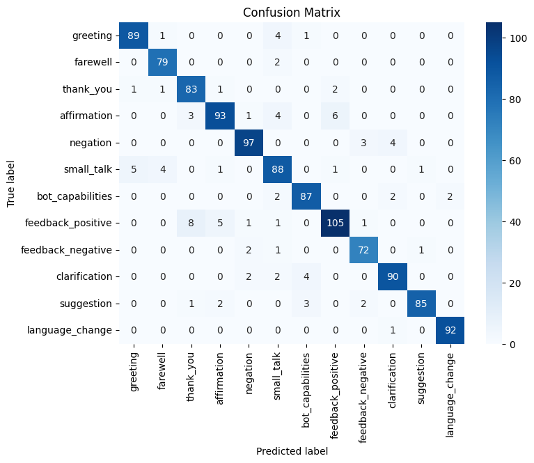

# Chatbot Intent Detection with LoRA Fine-Tuning

This repository presents a **chatbot intent detection model** fine-tuned using **LoRA (Low-Rank Adaptation)** for **parameter-efficient training**.  
The goal of the project is to classify user utterances into predefined intents, a common task in conversational AI systems.

The model was fine-tuned on a pretrained transformer and published on **Hugging Face Hub** for easy inference and reuse.

## Project Overview

- **Task:** Intent detection (multi-class classification)
- **Domain:** Chatbot / Conversational AI
- **Approach:** LoRA fine-tuning (PEFT)
- **Frameworks:** Hugging Face Transformers, PEFT, PyTorch
- **Training environment:** Google Colab (GPU)
- **Deployment:** Hugging Face Hub

## Dataset

The model was fine-tuned on the **[tanaos/synthetic-intent-classifier-dataset-v1](https://huggingface.co/datasets/tanaos/synthetic-intent-classifier-dataset-v1)** dataset.  
It contains **~11,500 synthetic examples** of user utterances labeled with 12 intents, covering common chatbot interactions.

### Intent categories

| Label ID | Category           | Description |
|---------:|--------------------|-------------|
| 0 | greeting | Greeting or saying hello. |
| 1 | farewell | Saying goodbye or farewell. |
| 2 | thank_you | Expressing gratitude or thanks. |
| 3 | affirmation | Agreeing or confirming something. |
| 4 | negation | Disagreeing or denying something. |
| 5 | small_talk | Engaging in casual or light conversation with no specific purpose. |
| 6 | bot_capabilities | Inquiries about the bot's features or abilities. |
| 7 | feedback_positive | Providing positive feedback about the bot, service, or experience. |
| 8 | feedback_negative | Providing negative feedback about the bot, service, or experience. |
| 9 | clarification | Asking for clarification or more information about a previous statement or question. |
| 10 | suggestion | Offering a suggestion or recommendation for improvement. |
| 11 | language_change | Requesting a change in the language being used by the bot or information about language options. |

## Model & Training

- **Base model:** `bert-base-uncased`
- **Fine-tuning method:** LoRA (Parameter-Efficient Fine-Tuning)
- **Number of intents:** 12
- **Loss function:** Cross-Entropy Loss
- **Early stopping:** enabled
- **Best validation accuracy:** ~0.94

LoRA was used to significantly reduce the number of trainable parameters while maintaining high performance, making the training more efficient and lightweight.

### Hyperparameter Experiments

Several hyperparameter adjustments were tested to optimize performance:

- Lowering the learning rate to 1e-4 resulted in a ~1% decrease in validation accuracy, therefore the original learning rate was retained.
- Increasing the number of epochs to 8 while using early stopping helped stabilize training without overfitting.
- The LoRA rank was kept at its default value to balance training efficiency and model performance, as changing it showed minimal impact on accuracy.

## Results

| Epoch | Training Loss | Validation Loss | Accuracy |
|------:|---------------|------------------|----------|
| 1 | 0.3868 | 0.2981 | 0.913 |
| 2 | 0.3253 | 0.2404 | 0.930 |
| 3 | 0.1870 | 0.2406 | 0.930 |
| 4 | 0.1854 | 0.2339 | **0.936** |
| 5 | 0.2050 | 0.2336 | 0.936 |
| 6 | 0.1580 | 0.2451 | 0.935 |

### Classification Report (test set)

| Intent              | Precision | Recall | F1-score | Support |
|---------------------|-----------|--------|----------|---------|
| greeting            | 0.94      | 0.94   | 0.94     | 95      |
| farewell            | 0.93      | 0.98   | 0.95     | 81      |
| thank_you           | 0.87      | 0.94   | 0.91     | 88      |
| affirmation         | 0.91      | 0.87   | 0.89     | 107     |
| negation            | 0.94      | 0.93   | 0.94     | 104     |
| small_talk          | 0.85      | 0.88   | 0.86     | 100     |
| bot_capabilities    | 0.92      | 0.94   | 0.93     | 93      |
| feedback_positive   | 0.92      | 0.87   | 0.89     | 121     |
| feedback_negative   | 0.92      | 0.95   | 0.94     | 76      |
| clarification       | 0.93      | 0.92   | 0.92     | 98      |
| suggestion          | 0.98      | 0.91   | 0.94     | 93      |
| language_change     | 0.98      | 0.99   | 0.98     | 93      |

**Overall accuracy:** 0.92  
**Macro average F1-score:** 0.92  
**Weighted average F1-score:** 0.92

### Confusion Matrix (test set)



The most frequent misclassifications occur between semantically related intents:

- `feedback_positive` is sometimes predicted as `thank_you`, reflecting the overlap between expressions of gratitude and positive feedback.
- Confusions between `affirmation` and `feedback_positive` suggest that short confirmations can be interpreted as implicit feedback.
- `small_talk` is occasionally classified as `greeting`, which is expected given their similar conversational role and informal language.

## Hugging Face Model

The fine-tuned model is available on Hugging Face Hub: **[https://huggingface.co/agataskrzyniarz/intent-detection-chatbot](https://huggingface.co/agataskrzyniarz/intent-detection-chatbot)**

## Inference

You can test the model using the provided script.

### Requirements

```
pip install transformers torch
```
### Example usage

```
python inference.py
```

or inside Python:

```
from transformers import pipeline

classifier = pipeline(
    "text-classification",
    model="agataskrzyniarz/intent-detection-chatbot"
)

classifier("Can you explain it to me?")
```
## Training Notebook

The full fine-tuning process is documented in the Google Colab notebook, including:
- data loading and preprocessing
- tokenization
- LoRA configuration
- training & evaluation
- analysis of results

### Requirements

```
pip install -r requirements.txt
```
